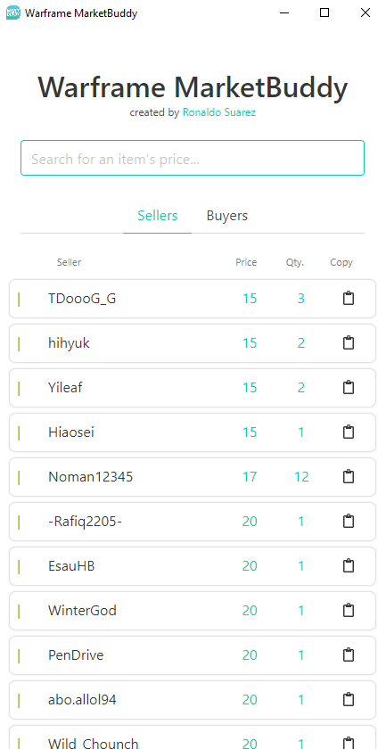

## Warframe MarketBuddy


<br>

Desktop application built using Electron and Bulma which searches the warframe.market api for sell and buy orders for a specified item. The aim
of this project is to make it easier to price-check items in warframe by just launching a simple desktop app rather than
going through the process of looking it up a browser.

<br>

### Why use this instead of the browser?
Because it is much faster, the application does not have to load all the ads and extra information that market sites nowadays contain
it is very straight forward, you get what you ask for.

<br>

Just like most trading sites I implemented a copy to clipboard functionality which allows for the user to click and instantly have
a whisper message for the seller/buyer.

<br>

### Installation

```
npm install
```

<br>

### UI


<br>

### Usage and Testing
To start and view the application `npm start`.
<br>

For packing the application `npm run pack`.
<br>

Creates and installer for the application `npm run dist`.

<br>

## License
[MIT](/LICENSE)